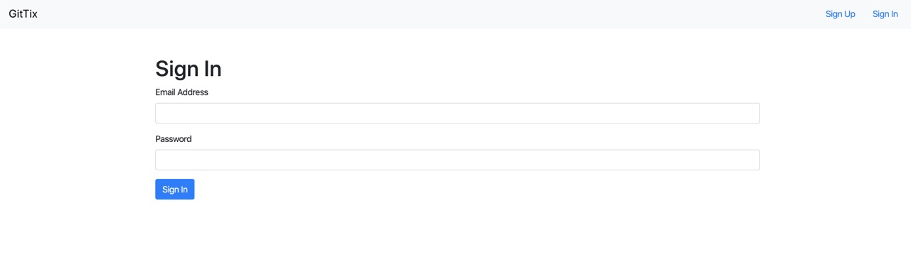
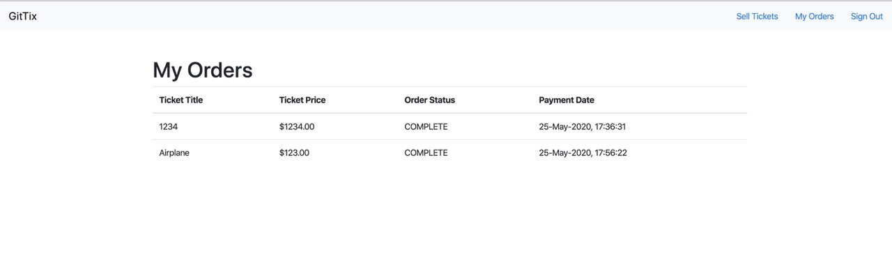
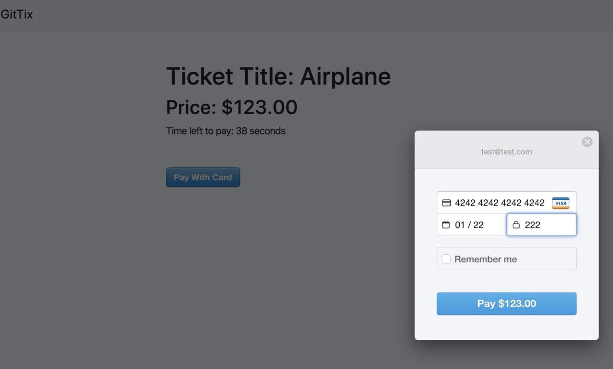

# Ticketing Microservices Project

This Ticketing Microservices project is a feature packed portfolio project for users to put a ticket for sale and allow other users to authenticate and buy the ticket within a specific window period.

## Technologies Involved

- Docker and Kubernetes for Microservices Orchestration
- Node JS for Server Side Environment
- React (Next JS) for Server Side Rendering
- NATS Streaming Server for Asynchronous Server to Server Communication
- MongoDB for Persistence Layer
- JWT for Authentication Flows between services
- Git Workflows for Testing, CI and CD
- Can be deployed to Cloud Services such as Digital Ocean
- Typescript for code quality
- Skaffold for Quick Development Workflow
- Stripe JS for Payment

To run the project locally,

1. Ensure that Docker for Mac or Docker for Windows is installed
2. Add a new host entry in host file (ticketing.dev --> 127.0.0.1)

```bash
skaffold dev
```






## Credits

Stephen Grider - Udemy Engineering Architect and Instructor for the wonderful course
